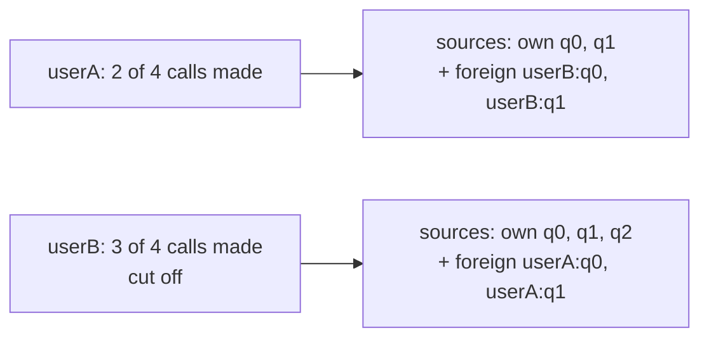
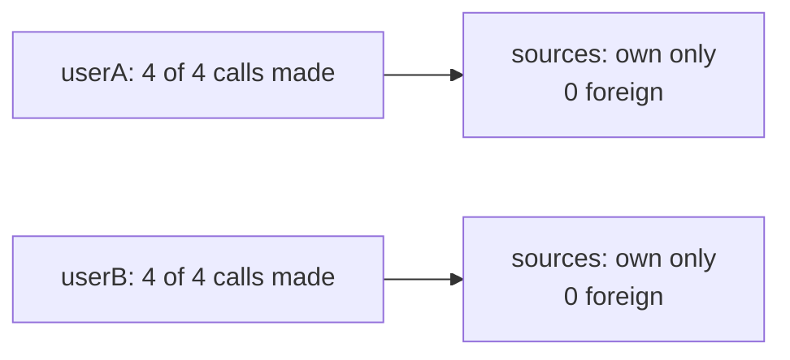

# ContextVar: Getrennte Rechnung for Parallel Agent Runs

The [structured output post](https://cpumarfrohberg.github.io/first_try_landed/blog/posts/structured_output_and_contracts/) left one thing unresolved: `list[dict]` in `SearchAgentResult` — an untyped field in an otherwise typed pipeline. That was one construction site in `user_behavior`. Bob found another one, and it was hiding behind code that looked correct.

## The setup

`user_behavior` routes natural-language questions to two sub-agents in parallel via `asyncio.gather` — a MongoDB/RAG agent and a Cypher agent. Each request has a budget of five tool calls. The budget lived in a shared module:

```python
_call_count = 0
_sources: list[str] = []
_lock = threading.Lock()

def reset() -> None:
    global _call_count, _sources
    with _lock:
        _call_count = 0
        _sources = []

def _check_and_increment() -> int:
    global _call_count
    with _lock:
        if _call_count >= MAX_CALLS:
            raise ToolCallLimitExceeded()
        _call_count += 1
        return _call_count
```

Locally: no issues. Under concurrent load: three failures at once.

Outside Germany, going out with a friend typically means one bill for the table — regardless of what each person ordered. That works fine until you both agreed to cap yourselves at five drinks, but the waiter keeps one shared tally. By your third drink the tally already reads five, because your friend's drinks are on the same count. You stop ordering. You've only had three. And at the end of the night, the receipt shows 15 drinks between all of the people sitting at the same table with no way to tell who had which.

## What broke

Python modules are singletons cached in `sys.modules`. `_call_count` is one integer in memory, shared by every thread in the process. Streamlit puts each user session on its own OS thread. Two simultaneous users share that integer.

Three failures:

1. Each agent called `reset_tool_call_count()` at startup, zeroing a counter the other agent had already incremented.
2. Both agents incremented the same `_call_count`, consuming each other's budgets.
3. `get_sources()` returned a mix of both users' source IDs — a data leak.

`threading.Lock` made each write atomic. It did not create per-request state.

The lock is the rule that only one person signals the waiter at a time. It prevents two people ordering in the same instant. The tally is still shared. Your self-imposed limit is still being eaten by someone else's count.

## The race

```
userA call 1 [count: 1]
→ userB call 1 [count: 2]
→ userA call 2 [count: 3]
→ userB call 2 [count: 4]
→ userA call 3 [count: 5 — MAX reached]
→ userB call 3 → ToolCallLimitExceeded (userB made 2 calls)
```



## The fix: `contextvars.ContextVar`

A `ContextVar` stores a separate value per execution context. Python creates a fresh context for each OS thread and for each `asyncio.Task`. When an agent reads `_call_count.get()`, it reads its own copy — nothing shared, no lock needed.

```python
import contextvars

_call_count: contextvars.ContextVar[int] = contextvars.ContextVar(
    "call_count", default=0
)
_sources: contextvars.ContextVar[tuple[str, ...]] = contextvars.ContextVar(
    "sources", default=()
)

def reset() -> None:
    _call_count.set(0)
    _sources.set(())

def _check_and_increment() -> int:
    n = _call_count.get()
    if n >= MAX_CALLS:
        raise ToolCallLimitExceeded()
    _call_count.set(n + 1)
    return n + 1

def _add_source(source: str) -> None:
    _sources.set(_sources.get() + (source,))
```

After the fix:



*Getrennte Rechnung*: each person tracks their own count. Your five calls are yours. Your friend's tally starts at zero and stays there. Free-riding structurally impossible.

## Why not `threading.local`?

`threading.local` gives isolation per OS thread — that would have separated the two Streamlit users. But all asyncio Tasks run on the same OS thread. Two parallel agents within one user's request still share a `threading.local` value.

If `threading.local` were enough, a single user running both agents in parallel would be safe. The reproduction shows it isn't — the race happens within one request, not just across users.

Moving to separate tables at the same restaurant doesn't help if the waiter still keeps one tally for the whole floor.

## One detail: the mutable default

`ContextVar("sources", default=[])` looks safe. It isn't. Every context that hasn't called `.set()` shares the same default list object. A stray `.append()` mutates it for every other context — the same leak in a different form.

`_sources` uses a tuple:

```python
_sources.set(_sources.get() + (source,))
```

A new tuple is created on every update. Nothing is mutated in place. Other contexts are unaffected. Use an immutable default — `()` or `None`. Mutation then requires an explicit `.set()`, which makes the write visible.

## Where you'll hit this in your own agent project

The pattern is not specific to `user_behavior`. It appears whenever an agent pipeline tracks per-request state at module level. Concrete cases to check in your own codebase:

- **Tool-call budgets** — any counter that resets at the start of a request and stops the agent when it hits a limit.
- **Source or citation lists** — any list built up during a run and returned with the final answer.
- **Rate limiting per request** — token counts, API call counters, cost accumulators.
- **Any module-level variable that `reset()` clears at request start** — if two requests overlap, each `reset()` clears the other's state.
- **Any pipeline using `asyncio.gather` to run sub-agents in parallel** — the race happens within a single request, not just across users.
- **Any agent served over Streamlit, FastAPI, or Gradio** — each user session runs on its own thread, all sharing the same module globals.

If your agent has any of these and the state lives at module scope, the bug is there. It just hasn't shown up yet.

## What this doesn't fix

`ContextVar` isolates per-task state. It doesn't address the design issue the bug exposed: tool-call tracking as module-level globals is fragile regardless of the isolation mechanism. The next step is to move the budget into an explicit object passed to each agent at construction — state that lives where it belongs, not at module scope.

*Getrennte Rechnung* means each person tracks their own tab. It doesn't mean the restaurant has a working point-of-sale system.

---

Primary sources: [PEP 567](https://peps.python.org/pep-0567/) introduced `contextvars` in Python 3.7. Reference: [docs.python.org/3/library/contextvars](https://docs.python.org/3/library/contextvars.html).
