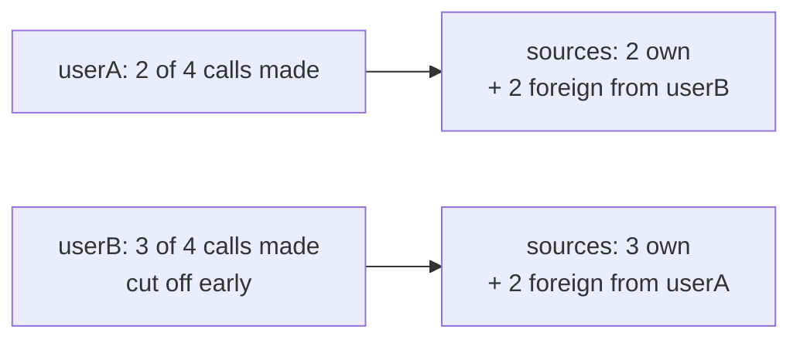
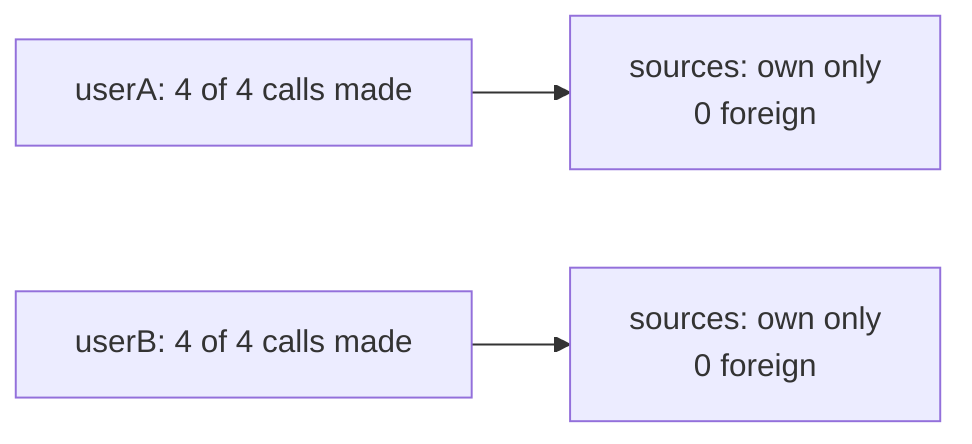

# ContextVar: Getrennte Rechnung for Parallel Agent Runs

Bob Belderbos recently wrote about [a race condition Rust wouldn't let you write](https://belderbos.dev/blog/race-condition-rust-wouldnt-let-me-write/) — a tool-call counter shared between parallel agents in my multi-agent project. He walked through how Rust's compiler would have blocked the bug at four different points. This is the Python side: how `contextvars.ContextVar` fixed it, and where you'll hit the same pattern in your own multi-agent orchestrators.

The bug appeared when an orchestrator called both agents — MongoDB for text search and Cypher for graph queries — in parallel via `asyncio.gather`. Testing agents individually: no issues. Running both in parallel: agents hit their five-call limit after two or three actual calls because they consumed each other's budgets from a shared counter.

## The setup

An orchestrator agent routes natural-language questions to specialized sub-agents in parallel via `asyncio.gather` — a MongoDB agent for text search and a Cypher agent for graph queries. Each sub-agent has a budget of five tool calls. The budget lived in a shared module:

```python
_call_count = 0
_sources: list[str] = []
_lock = threading.Lock()

def reset() -> None:
    global _call_count, _sources
    with _lock:
        _call_count = 0
        _sources = []

def _check_and_increment() -> int:
    global _call_count
    with _lock:
        if _call_count >= MAX_CALLS:
            raise ToolCallLimitExceeded()
        _call_count += 1
        return _call_count
```

Locally: no issues. Under concurrent load: three failures at once.

In Germany, you can ask for *Getrennte Rechnung* — separate checks. Each person's tab is tracked independently. Everywhere else, restaurants often default to one shared bill for the table. That works fine until you and a friend both agree to cap yourselves at five drinks (which in Berlin counts as showing restraint), but the waiter keeps one shared tally. By your third drink, the count reads five — your friend already ordered two. You stop. You've only had three. At the end of the night, the receipt shows 15 drinks across everyone at the table with no way to tell who had which.

## What broke

Python modules are singletons cached in `sys.modules`. `_call_count` is one integer in memory, shared by every thread in the process. Streamlit puts each user session on its own OS thread. Two simultaneous users share that integer.

This creates a **race condition** — the outcome depends on unpredictable timing. Three failures result:

1. Each agent called `reset_tool_call_count()` at startup, zeroing a counter the other agent had already incremented.
2. Both agents incremented the same `_call_count`, consuming each other's budgets.
3. `get_sources()` returned a mix of both users' source IDs — a data leak.

`threading.Lock` made each write atomic (preventing memory corruption), but it didn't create per-request isolation. The lock ensures **thread safety** at the operation level — no corrupted increments. It doesn't provide **request isolation** — separate state per agent run.

The lock is the rule that only one person signals the waiter at a time. It prevents two people ordering in the same instant. The tally is still shared. Your self-imposed limit is still being eaten by someone else's count.

## The race



## The fix: `contextvars.ContextVar`

A `ContextVar` stores a separate value per execution context. Python creates a fresh context for each OS thread and for each `asyncio.Task`. When an agent reads `_call_count.get()`, it reads its own copy — nothing shared, no lock needed.

```python
import contextvars

_call_count: contextvars.ContextVar[int] = contextvars.ContextVar(
    "call_count", default=0
)
_sources: contextvars.ContextVar[tuple[str, ...]] = contextvars.ContextVar(
    "sources", default=()
)

def reset() -> None:
    _call_count.set(0)
    _sources.set(())

def _check_and_increment() -> int:
    n = _call_count.get()
    if n >= MAX_CALLS:
        raise ToolCallLimitExceeded()
    _call_count.set(n + 1)
    return n + 1

def _add_source(source: str) -> None:
    _sources.set(_sources.get() + (source,))
```

After the fix:



*Getrennte Rechnung*: each person tracks their own count. Your five calls are yours. Your friend's tally starts at zero and stays there. Free-riding structurally impossible.

## Why not `threading.local`?

`threading.local` gives isolation per OS thread — that would have separated the two Streamlit users. But **all asyncio Tasks run on the same OS thread**. When `asyncio.gather` runs both agents, they execute **concurrently** (interleaved by the event loop during I/O waits), not in **parallel** (simultaneously on separate CPU cores). Two agents within one request still share a `threading.local` value because they share the same OS thread.

This is the key distinction: `asyncio.gather` creates separate execution contexts (Tasks) without creating separate threads. `threading.local` can't distinguish between them.

If `threading.local` were enough, a single user running both agents in parallel would be safe. The reproduction shows it isn't — the race happens within one request via `asyncio.gather`, not just across users.

Moving to separate tables at the same restaurant doesn't help if the waiter still keeps one tally for the whole floor.

## One detail: the mutable default

`ContextVar("sources", default=[])` looks safe. It isn't. Every context that hasn't called `.set()` shares the same default list object. A stray `.append()` mutates it for every other context — the same leak in a different form.

`_sources` uses a tuple:

```python
_sources.set(_sources.get() + (source,))
```

A new tuple is created on every update. Nothing is mutated in place. Other contexts are unaffected. Use an immutable default — `()` or `None`. Mutation then requires an explicit `.set()`, which makes the write visible.

## Where you might hit this

This bug appears when three conditions meet: module-level per-request state, concurrent execution, and singleton agents. If you're missing any of these, you won't hit it.

**You're at risk if:**

- **Tool-call budgets** — tracked in module-level counters that reset at request start
- **Source or citation lists** — accumulated at module scope during a run
- **Rate limiting per request** — token counts, API call counters, cost accumulators stored as module variables
- **Orchestrators using `asyncio.gather`** — running sub-agents in parallel on the same singleton instances
- **Web frameworks** — Streamlit, FastAPI, or Gradio where each session/request runs on its own thread

**You're safe if:**

- You create new agent instances per request (no shared state)
- You pass state explicitly through function parameters or dependency injection
- You run agents sequentially, one at a time
- Your state lives in request-scoped objects, not module globals

The bug needs all three: module globals + concurrency + reused instances. If your architecture avoids module-level state, you don't have this problem — whether or not you use `ContextVar`.

## What this doesn't fix

`ContextVar` isolates per-task state. It doesn't address module-level globals. Why not move the budget into a class?

```python
class ToolCallBudget:
    def __init__(self, max_calls: int = 5):
        self.count = 0
        self.sources: list[str] = []

    def check_and_increment(self) -> int:
        if self.count >= self.max_calls:
            raise ToolCallLimitExceeded()
        self.count += 1
        return self.count
```

That works if you create a new agent per request:

```python
agent = MongoDBSearchAgent(budget=ToolCallBudget())
result = await agent.query(question)
```

But most agent architectures reuse the same agent instance across requests — initialization is expensive (model loading, connections, prompt compilation). The budget is per-request, not per-agent-instance. You'd need to thread it through every `query()` call and every tool:

```python
async def query(self, question: str, budget: ToolCallBudget):
    await some_tool(question, budget)  # now every tool signature changes
```

If tools access the budget from many places, that's significant refactoring. `ContextVar` is appropriate here because the state is request-scoped but the agent is singleton-scoped. It's not a workaround; it's the right model for implicit per-request context in a shared-instance architecture.

*Getrennte Rechnung* is the right model when the waiter (agent) serves many tables (requests) — you need per-table isolation, not a separate waiter for each table.

---

Primary sources: [PEP 567](https://peps.python.org/pep-0567/) introduced `contextvars` in Python 3.7. Reference: [docs.python.org/3/library/contextvars](https://docs.python.org/3/library/contextvars.html). Concurrency terminology from Chapter 19 "Concurrency Models in Python" in *Fluent Python* (2nd ed.) by Luciano Ramalho.
